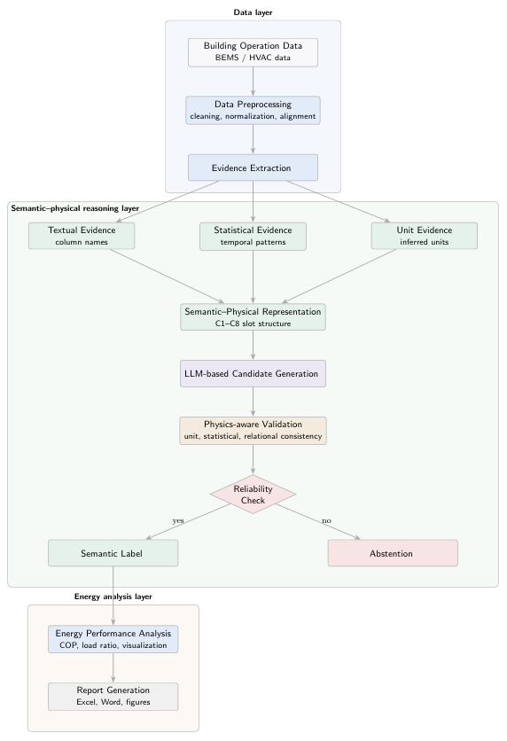

# HVAC AI Analyzer

A Python-based intelligent HVAC data analysis system integrating semantic column recognition, physical consistency validation, and energy performance evaluation.

---

## Overview

HVAC AI Analyzer is designed to automate the interpretation and analysis of building operation data (BEMS), reducing manual preprocessing effort and improving reliability.

The system combines:

- Rule-based logic
- LLM-assisted semantic reasoning
- Physics-aware validation

to achieve robust understanding of HVAC datasets.

---

## Key Contributions

- Semantic–physical hybrid reasoning framework
- C1–C8 multi-slot representation for HVAC variables
- LLM-based hypothesis generation with constraint validation
- Automatic COP calculation and energy performance analysis
- ABSTAIN mechanism for uncertainty handling

---

## System Architecture

  

  <em>Click the figure to view high-resolution PDF version.</em>

