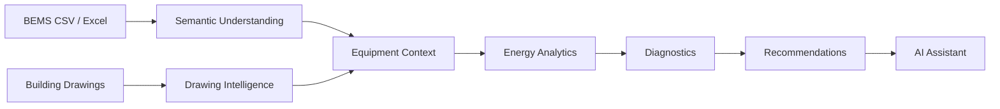
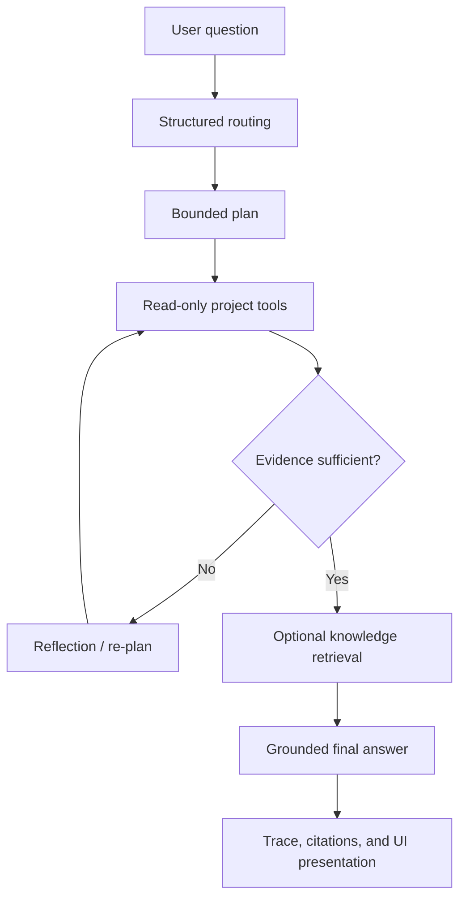
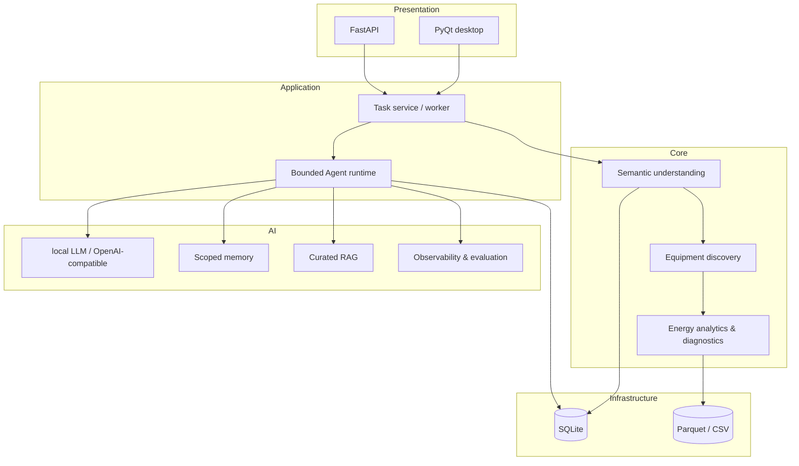

# BuildingAI

> **Agentic AI for Building Energy Intelligence**

Turn heterogeneous BEMS data and building drawings into equipment-aware energy analysis, diagnostics, and actionable recommendations.

面向建筑运行数据与图纸的多模态智能能源分析与 Agent 应用平台。

[](https://www.python.org/)
[](https://github.com/KaedeharaT/hvac-ai-analyzer/actions/workflows/ci.yml)


**English | [简体中文](README_zh.md)** · [Architecture](docs/architecture.md) · [Drawing Intelligence](docs/drawing_intelligence.md) · [Knowledge sources](docs/knowledge_sources.md)


*BEMS + Drawings → Equipment Context → Analytics → Diagnostics → AI Assistant. Local, anonymized demonstration project.*

## What it does

- Understands unfamiliar Chinese, English, and Japanese BEMS / HVAC point names.
- Organizes equipment and operating signals into a project-specific equipment context.
- Calculates only the energy, power, temperature, COP, and ΔT indicators supported by the available data.
- Presents capability-driven energy analysis with explicit chart scope, axes, units, and legends.
- Produces HVAC findings from project evidence and deterministic engineering logic, then turns them into practical next steps.
- Ingests PNG / JPG / JPEG drawings through an optional YOLOv8 adapter, with bounding boxes, human review, and manual equipment association.
- Answers questions through read-only project tools and a separate, cited multilingual knowledge base.

## Why it matters

Building energy analysis often starts with a difficult manual task: interpreting hundreds of inconsistent BEMS point names before engineers can tell which equipment matters or what the data means. BuildingAI reduces that setup work by organizing heterogeneous operational data into equipment-aware analysis, then presenting the result as evidence-backed insights that engineers and non-specialists can act on.

**BuildingAI is not a generic chatbot.** It works with BEMS operational data, drawing evidence, equipment relationships, engineering KPIs, and deterministic findings. The LLM / Agent layer is used for task orchestration, read-only tool use, evidence completion, explanation, and knowledge retrieval. There is no BAS write path: site teams remain responsible for validation and operational decisions.

## From raw data to action


```mermaid
flowchart LR
    A[BEMS CSV / Excel] --> B[Semantic Understanding]
    D[Building Drawings] --> E[Drawing Intelligence]
    B --> C[Equipment Context]
    E --> C
    C --> F[Energy Analytics]
    F --> G[Diagnostics]
    G --> H[Recommendations]
    H --> I[AI Assistant]
```

## Product experience

### 1. Building Overview

The dashboard organizes measured energy, demand, equipment status, and reviewed operational findings into a project-level view that can be read quickly.

### 2. Professional Energy Analysis

Energy Analysis dynamically shows only the indicators the selected project can support: energy, power, temperature, ΔT, COP, typical daily profile, heatmap, and equipment comparison. Each chart exposes its scope, axis meaning, unit, and series legend rather than relying on an unlabeled line.


### 3. Evidence-grounded Diagnostics

Findings are derived from actual project data and deterministic engineering logic; general RAG material is used to explain a finding or suggest safe checks, not to invent one. Recommendations remain bounded by the available evidence and require site validation.


### 4. AI Assistant with source-aware answers

The Assistant shows a concise analysis process, separates **Project evidence** from **Reference material**, and makes each cited official source available through the UI. Internal tool identifiers stay inside the technical trace rather than in normal user-facing language.


### 5. Drawing Intelligence

BuildingAI can ingest architectural / HVAC drawings through an optional YOLOv8 vision adapter. Detection boxes remain AI predictions until reviewed; confirmed objects can then be manually linked to project equipment for downstream read-only Agent queries.


*Synthetic demonstration drawing. The current legacy YOLOv8 model supports `aircon`, `baseline_mark`, and `window`; model weights are not distributed with this repository. Equipment-to-drawing association is human-confirmed, not automatic.*

For example, when asked “Where is AHP-3-3 on the drawing?”, the Agent reads a confirmed drawing mapping and returns the drawing, page, and object information. Without one, it abstains: `No reliable drawing association has been confirmed for this equipment.`

### 6. Knowledge Base

The searchable Knowledge Base provides multilingual HVAC, operations, and energy-saving guidance with source attribution; the catalog and its scope are described below.


## Agentic AI in one real workflow

For a question such as **“Which machine is doing the worst?”**, the Agent plans bounded read-only queries, checks whether project evidence is sufficient, retrieves engineering guidance only when useful, and keeps project facts separate from reference material.


```mermaid
flowchart TD
    Q[User question] --> R[Structured routing]
    R --> P[Bounded plan]
    P --> T[Read-only project tools]
    T --> E{Evidence sufficient?}
    E -- No --> X[Reflection / re-plan]
    X --> T
    E -- Yes --> K[Optional knowledge retrieval]
    K --> A[Grounded final answer]
    A --> O[Trace, citations, and UI presentation]
```

Planning · Tool Calling · Evidence Checking · Reflection · Memory · RAG · Trace. The runtime is deliberately read-only: it does not call building-control protocols or issue operational commands.

## A curated building-energy knowledge base

BuildingAI includes a compact, attributed knowledge catalog for **China, the United States, and Japan**:

- **19 trusted sources** and **154 curated knowledge chunks**
- Original language retained across **中文 / English / 日本語**
- Normalized concepts connect terms such as `chilled water pump` / `冷冻水泵` / `冷水ポンプ`
- Covers semantic mapping, equipment/system relationships, engineering principles, O&M, controls, energy saving, retrofit, and ZEB guidance

Representative sources include Project Haystack, Brick Schema, public Brick / ASHRAE 223 connection guidance, DOE FEMP, NREL / EnergyPlus, DOE Better Buildings, and public guidance from China and Japan. The catalog contains compact attributed summaries and structured ontology facts; it does not copy paywalled standards, vendor manuals, or user documents.

**Important boundary:** project data determines what happened in a particular building. RAG knowledge is used only to explain concepts, suggest cause candidates, and recommend safe next checks—it never creates a project finding by itself.

See the complete [source registry, usage notes, and rebuild policy](docs/knowledge_sources.md).

## Evaluation: stability plus real-model behavior

BuildingAI uses a two-layer **internal evaluation suite**, not a public benchmark.

The LLM layer is configurable and model-agnostic. Qwen is currently used as one local evaluation model, but the application and Agent logic are not tied to it. Any provider or model change requires a fresh end-to-end evaluation; the metrics below describe only the documented Qwen configuration.

| Layer | Purpose | Current documented run |
| --- | --- | --- |
| **Deterministic Agent Regression Suite** | Fast engineering regression for routing, tool calling, grounding, abstention, memory, RAG retrieval, tool failure, and prompt-injection boundaries. | 66 cases. |
| **Local LLM End-to-End Evaluation** | Executes the complete bounded Agent path with a locally configured open-source LLM, including tools, evidence checks, RAG where relevant, and final-answer generation. | 52 internal cases; Qwen2.5-7B is the documented test configuration. |

The end-to-end suite contains natural-language paraphrases, multi-turn memory, ambiguous requests, missing-data and unknown-equipment abstention, prompt injection, RAG, and tool-degradation cases. It is an internal engineering evaluation, not a public benchmark or a claim of generalization to all building projects.

```powershell
# Fast deterministic regression
python scripts/run_agentic_evaluation.py

# Local LLM end-to-end smoke / full run
python scripts/run_e2e_agent_eval.py --quick
python scripts/run_e2e_agent_eval.py --full
```

Evaluation artifacts record provider/model identity, real LLM latency, tool calls, reflections, citations, deterministic failure categories, and safe answer summaries. Token usage is shown as `N/A` when a local provider does not expose it.

## Architecture


```mermaid
flowchart TB
    subgraph Presentation
        UI[PyQt desktop]
        API[FastAPI]
    end
    subgraph Application
        TASK[Task service / worker]
        AGENT[Bounded Agent runtime]
    end
    subgraph Core
        SEM[Semantic understanding]
        EQUIP[Equipment discovery]
        ANALYTICS[Energy analytics & diagnostics]
    end
    subgraph AI
        LLM[local LLM / OpenAI-compatible]
        MEM[Scoped memory]
        RAG[Curated RAG]
        TRACE[Observability & evaluation]
    end
    subgraph Infrastructure
        DB[(SQLite)]
        DATA[(Parquet / CSV)]
    end
    UI --> TASK
    API --> TASK
    TASK --> AGENT
    TASK --> SEM --> EQUIP --> ANALYTICS
    AGENT --> LLM
    AGENT --> MEM
    AGENT --> RAG
    AGENT --> TRACE
    SEM --> DB
    ANALYTICS --> DATA
    AGENT --> DB
```

The desktop UI only presents state and starts workflows. Services orchestrate reusable domain functions; core modules do not import PyQt. See the concise [architecture notes](docs/architecture.md) for data, persistence, LLM, and safety boundaries.

## Quick start

BuildingAI supports Python 3.10+.

```powershell
git clone https://github.com/KaedeharaT/hvac-ai-analyzer.git
cd hvac-ai-analyzer
python -m venv .venv
.\.venv\Scripts\Activate.ps1
python -m pip install -r requirements.txt
python app.py
```

The desktop application works without an LLM. To enable a local open-source LLM, install [Ollama](https://ollama.com/) or use a compatible local endpoint, configure `LLM_MODEL`, and select/test the connection in **Settings**. No model is downloaded or selected by the repository.

### API

```powershell
python -m pip install -r requirements-server.txt
python -m uvicorn building_ai.api.app:app --host 127.0.0.1 --port 8000
```

### Build the knowledge base

```powershell
python scripts/build_knowledge_base.py
```

The command regenerates curated records, multilingual aliases, portable chunks, the keyword/CJK index, and the configured local SQLite retrieval store. It does not download or commit private building data.

### Tests

```powershell
python -m pytest
```

Public fresh-clone verification: **110 passed, 1 skipped**. The skipped
research-fixture smoke test is intentional because its private fixture is not
distributed. The `v1.2.0` release tag retains its recorded **110 passed**
release verification.

## Project structure

```text
building_ai/   Desktop UI, services, core analytics, Agent runtime, storage, and API
knowledge/     Curated source registry, multilingual records, chunks, aliases, and index
tests/         Unit, integration, UI, security, and evaluation-support tests
scripts/       Knowledge build, evaluation, acceptance, and screenshot helpers
docs/          Architecture, source policy, and repository documentation
```

## Research background and scope

BuildingAI originates from research on automatically interpreting heterogeneous HVAC/BEMS operational data. This repository turns that research direction into a working AI application with a desktop workflow, API boundary, observability, curated knowledge, and evaluation.

It is an engineering platform / research prototype, not a replacement for site commissioning or a production BAS controller. COP, diagnostics, and recommendations must be validated against the actual building before operational changes are made.

## Further reading

- [Chinese README](README_zh.md)
- [Architecture and boundaries](docs/architecture.md)
- [Local real-usage evaluation](docs/real_usage_evaluation.md)
- [Drawing Intelligence boundary](docs/drawing_intelligence.md)
- [Knowledge source registry and licensing](docs/knowledge_sources.md)
- [Research-to-product mapping](docs/research_to_product.md)
- [Migration notes](docs/migration.md)

## License

Code is released under the [MIT License](LICENSE). Third-party knowledge sources retain their original terms; see [docs/knowledge_sources.md](docs/knowledge_sources.md).
