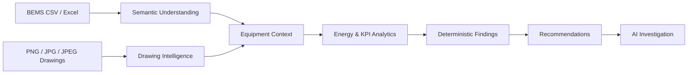
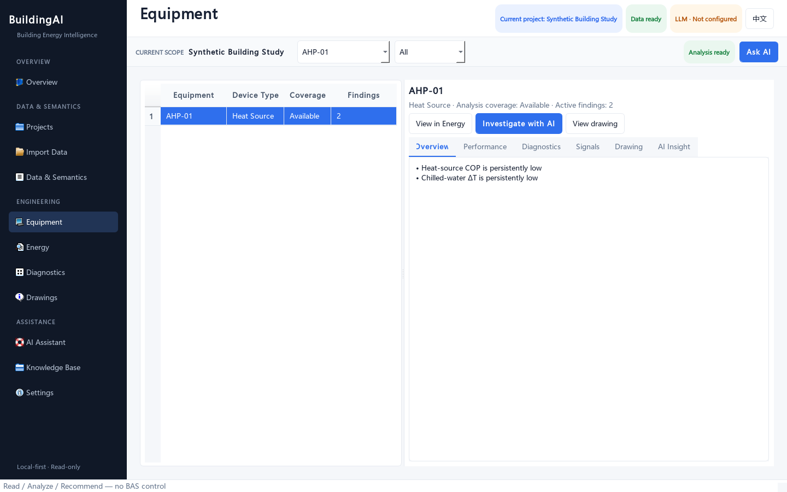
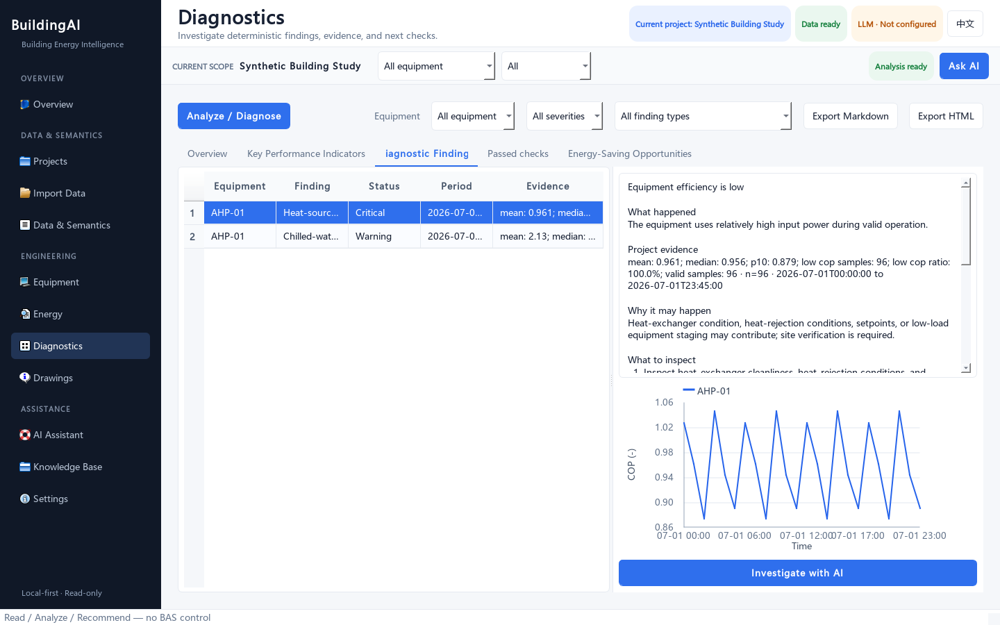
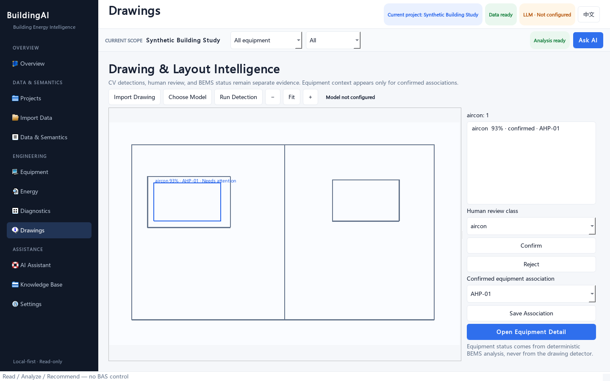
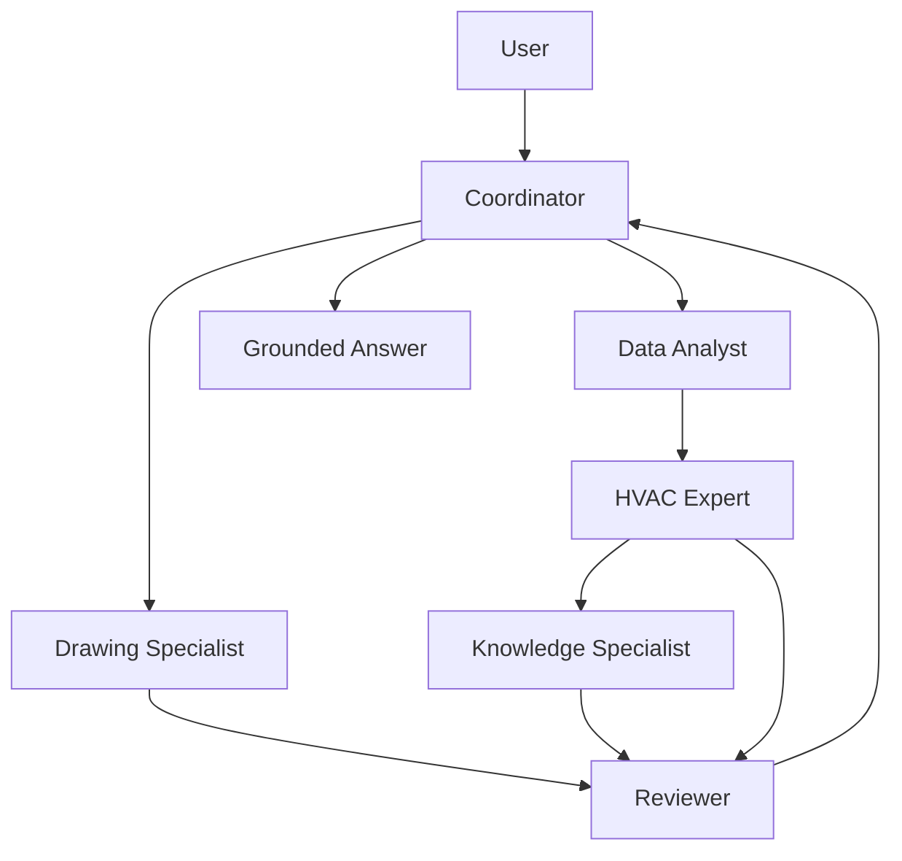
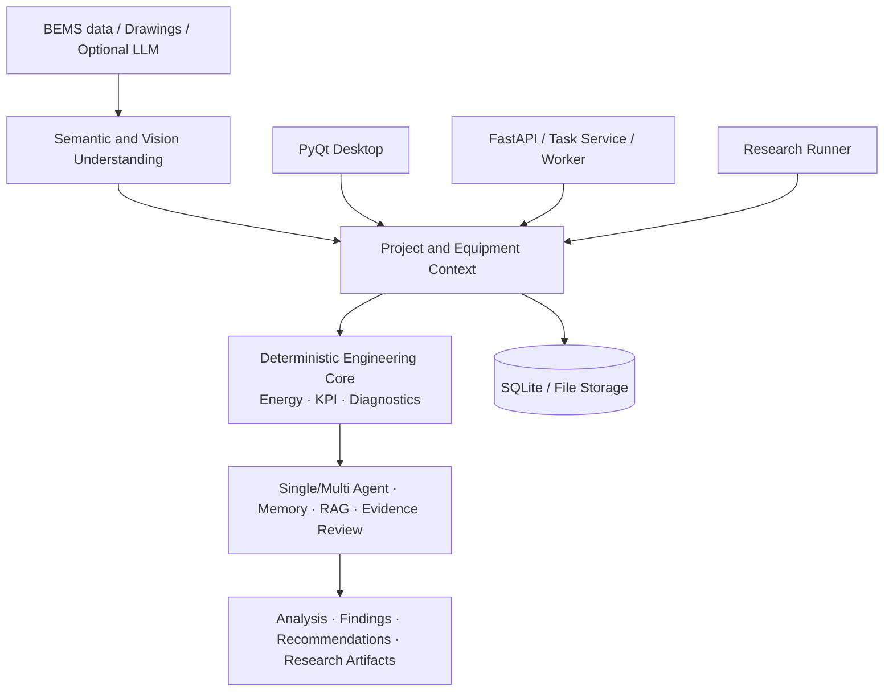

# BuildingAI

### Agentic AI Platform for Building Energy Intelligence

Turn heterogeneous BEMS data and building drawings into equipment-aware analytics, diagnostics, and evidence-grounded energy-saving recommendations.

[](https://github.com/KaedeharaT/hvac-ai-analyzer/actions/workflows/ci.yml)

**English | [简体中文](README_zh.md)**


*Current PyQt interface using a synthetic, privacy-safe demonstration project.*

## What BuildingAI solves

BEMS projects rarely arrive with a shared schema. Point names vary between sites, Chinese, English, and Japanese labels may coexist, equipment relationships are implicit, and each dataset supports a different set of engineering calculations. Engineers therefore spend substantial time organizing data before they can investigate performance.

BuildingAI turns that work into one reviewable flow:


```mermaid
flowchart LR
    B[BEMS CSV / Excel] --> S[Semantic Understanding]
    D[PNG / JPG / JPEG Drawings] --> V[Drawing Intelligence]
    S --> E[Equipment Context]
    V --> E
    E --> A[Energy & KPI Analytics]
    A --> F[Deterministic Findings]
    F --> R[Recommendations]
    R --> I[AI Investigation]
```

It is not a generic chatbot. Project facts come from imported data, reviewed mappings, deterministic engineering calculations, and confirmed drawing evidence. The Agent selects read-only tools, completes evidence, retrieves professional references, and explains results; it cannot control a BAS or modify project evidence.

## Product workflow

### Overview and data readiness

The project overview prioritizes data readiness, analysis coverage, energy summaries, active findings, and equipment that needs review. Onboarding exposes imported, mapped, review-required, abstained, and confirmed points so unavailable analytics have an explicit reason.

### Equipment-centric investigation

Equipment is the main investigation unit rather than a collection of unrelated charts. An equipment detail view connects identity, available signals, KPI coverage, COP, ΔT, power, energy, trends, deterministic findings, passed checks, drawing mappings, and contextual AI entry points.



*Synthetic equipment and operational data.*

### Professional Energy Analysis

A shared scope controls project equipment, custom date/time range, and resolution. Supported resolutions are **1 minute, 10 minutes, 1 hour, 1 day, 1 week, 1 month, and 1 year**. BuildingAI never interpolates or duplicates samples to create a resolution finer than the source data.

The calculation boundary remains physical:

- power is aggregated by mean; peak power is always the raw maximum inside the selected scope;
- interval energy is summed, while cumulative meters are differenced before aggregation;
- temperature, ΔT, and COP are averaged; COP retains its valid-sample count;
- chart metadata records period, resolution, and equipment, and the time axis changes between time, date, week, month, and year;
- daily profiles and date/time heatmaps are shown only at meaningful sub-daily resolutions.

Available views include energy, power, temperature, ΔT, COP, typical daily profile, heatmap, weather relation, equipment comparison, and custom period comparison. They are capability-driven: a project without the required signals gets an explanation, not an empty chart or fabricated value.


*Synthetic time-series data; axes, units, scope, and aggregation are produced by the current application.*

### Evidence-grounded Diagnostics

A finding is generated from project data and deterministic engineering rules. The investigation view keeps five concepts separate:

1. **Finding** — what the rule detected.
2. **Project Evidence** — measurements, period, and valid samples.
3. **Possible Causes** — hypotheses to inspect, not confirmed faults.
4. **Recommended Checks** — bounded next actions and verification metrics.
5. **Reference Material** — general engineering guidance retrieved from the Knowledge Base.

Passed checks mean only that an executed rule did not trigger under the available evidence; they do not certify that equipment is healthy. Financial savings are not invented when tariff or intervention evidence is absent.



*Synthetic finding and supporting evidence.*

### Context-aware AI Assistant

The Assistant inherits the selected project, equipment, page, and finding context. Guided prompts support investigation without making users repeat identifiers. Responses present the investigation result, evidence checked, possible causes, recommended checks, and citations while keeping **Project Evidence** separate from **Reference Material**.


*Synthetic project context; the normal read-only Agent runtime produced the displayed investigation.*

### Drawing Intelligence

The optional Ultralytics adapter loads a locally configured YOLOv8 detector for PNG, JPG, and JPEG drawings. The current legacy model vocabulary is limited to `aircon`, `baseline_mark`, and `window`; weights are not distributed with this repository.

Bounding boxes and confidence values remain AI predictions until a person confirms or rejects them. Only a human-confirmed object can be manually associated with equipment and exposed to the Agent as project evidence. Detection does not infer equipment health, topology, or an automatic BEMS-to-drawing match.



*Synthetic demonstration drawing and test detector output; no private drawing or model weight is included.*

### Searchable Knowledge Base

The repository contains **19 attributed sources** and **154 curated chunks** from China, the United States, Japan, and a small original multilingual engineering synthesis. Search preserves 中文 / English / 日本語 and returns source metadata and URLs.

Project data answers *what happened here*. Knowledge retrieval supports *why it may happen, what to inspect, and how to improve*. A retrieved passage cannot create a project finding.


See the [source registry, licensing boundary, and deterministic rebuild process](docs/knowledge_sources.md).

## Single-Agent and Multi-Agent runtimes

Single-Agent remains the default product runtime and research baseline. An optional role-specialized Multi-Agent V1 supports controlled comparison and complex investigations; it is not assumed to be better.


```mermaid
flowchart TD
    U[User] --> C[Coordinator]
    C --> D[Data Analyst]
    C --> W[Drawing Specialist]
    D --> H[HVAC Expert]
    H --> K[Knowledge Specialist]
    W --> R[Reviewer]
    K --> R
    H --> R
    R --> C
    C --> O[Grounded Answer]
```

Specialists exchange typed evidence packets and have separate tool allowlists. The Data Analyst cannot use RAG, the Knowledge specialist cannot declare project facts, the Drawing specialist reads confirmed associations only, and the Reviewer can approve, request evidence, flag conflict, or require abstention. All registered Agent tools are read-only. Parent/child Agent, Tool, LLM, evidence, reflection, and latency traces remain available for technical review.

See [Multi-Agent architecture and permission boundaries](docs/multi_agent_architecture.md).

## Research and reproducibility

The product UI and headless research runner call the same domain services. The research layer adds governance without publishing private data:

- SHA-256 dataset identity and immutable data revisions;
- independently frozen ground truth and project-level development / validation / frozen-test / external-test splits;
- experiment IDs, Git and dirty-tree provenance, config and environment snapshots, seed, prompt/policy versions, and knowledge hashes;
- finalized artifact manifests, validation, replay, and failed-run retention;
- config-driven baseline / ablation matrices and repeated LLM runs with aggregate statistics;
- Agent trace export, CV model/split provenance, CSV/JSON/Parquet results, and SVG/PDF/PNG publication output;
- paper claim-to-experiment mapping.

Private datasets, annotations, splits, weights, and generated experiment artifacts remain gitignored. Start with the [research protocol](docs/research_protocol.md), [readiness audit](docs/research_readiness_audit.md), and [paper result mapping](docs/paper_result_mapping.md).

## Evaluation

The repository uses deterministic tests for product, engineering, safety, research provenance, Single-Agent, and Multi-Agent behavior. The current candidate was revalidated before publication; the exact pytest total and regression results below correspond to this main revision.

| Check | Current main result |
| --- | --- |
| pytest | **175 passed** |
| Single-Agent deterministic regression | **66 / 66** |
| Multi-Agent deterministic regression | **66 / 66** |
| Agentic Acceptance | **26 PASS / 0 FAIL** |

The separate 52-case Local-LLM E2E suite is a **documented internal evaluation**, not a public benchmark and not rerun by GitHub CI. Provider/model changes require a new run; automatic metrics do not claim human-verified hallucination rates.

GitHub Actions installs `requirements.txt`, runs the full pytest suite, and runs the deterministic Single-Agent regression on Python 3.10 and 3.11.

## Architecture


```mermaid
flowchart TB
    IN[BEMS data / Drawings / Optional LLM] --> U[Semantic and Vision Understanding]
    U --> EC[Project and Equipment Context]
    EC --> CORE[Deterministic Engineering Core<br/>Energy · KPI · Diagnostics]
    CORE --> AI[Single/Multi Agent · Memory · RAG · Evidence Review]
    AI --> OUT[Analysis · Findings · Recommendations · Research Artifacts]
    UI[PyQt Desktop] --> EC
    API[FastAPI / Task Service / Worker] --> EC
    RES[Research Runner] --> EC
    EC --> DB[(SQLite / File Storage)]
```

Semantic mapping, equipment discovery, KPI calculation, diagnosis rules, YOLO inference, storage, and retrieval remain deterministic services rather than being renamed as Agents. See [architecture and safety boundaries](docs/architecture.md).

## Quick start

Python 3.10+ is supported.

```powershell
git clone https://github.com/KaedeharaT/hvac-ai-analyzer.git
cd hvac-ai-analyzer
python -m venv .venv
.\.venv\Scripts\Activate.ps1
python -m pip install -r requirements.txt
python app.py
```

The desktop starts without Ollama, Redis, or a YOLO model. Deterministic analysis remains available; optional features report that their provider/model is not configured. To run the optional API and Redis/RQ adapter dependencies:

```powershell
python -m pip install -r requirements-server.txt
python -m uvicorn building_ai.api.app:app --host 127.0.0.1 --port 8000
```

Useful verification commands:

```powershell
python -m pytest
python scripts/run_agentic_evaluation.py
python scripts/run_multi_agent_evaluation.py
python scripts/run_agentic_acceptance.py
python scripts/build_knowledge_base.py
```

## Scope and safety

BuildingAI is an engineering analysis and research platform, not a production BAS controller, CMMS, or substitute for site commissioning. It has no BACnet, Modbus, OPC, or equipment-control write path. Results and recommendations must be checked against the real building before operational changes.

Code is available under the [MIT License](LICENSE). Third-party references retain their own terms; BuildingAI stores compact attributed summaries rather than redistributed paywalled standards or private documents.
