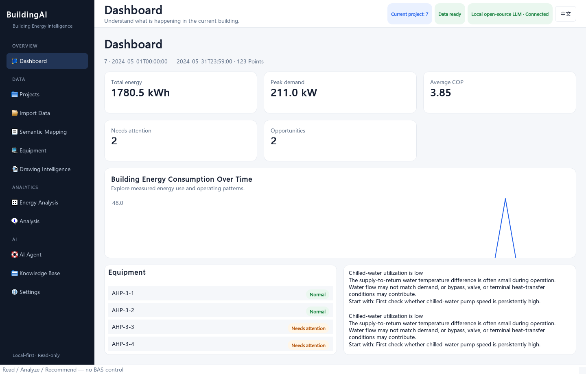
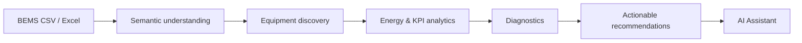
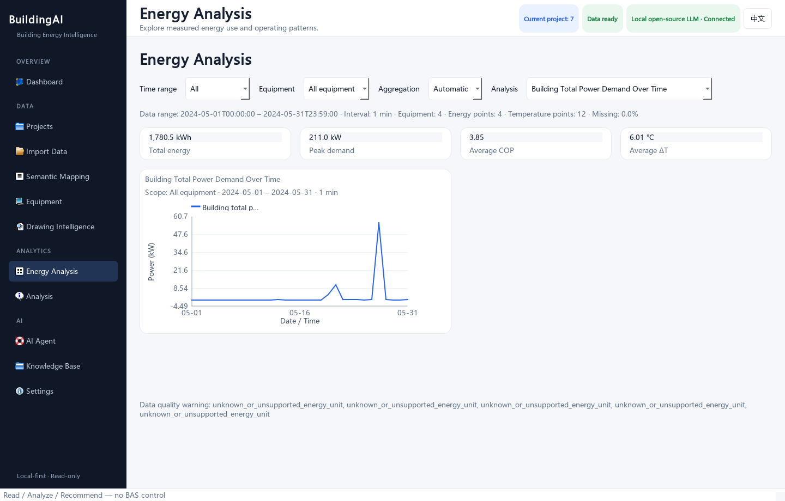
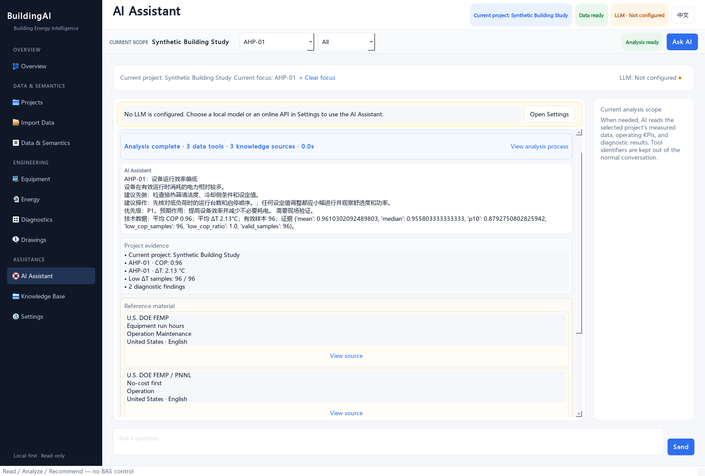
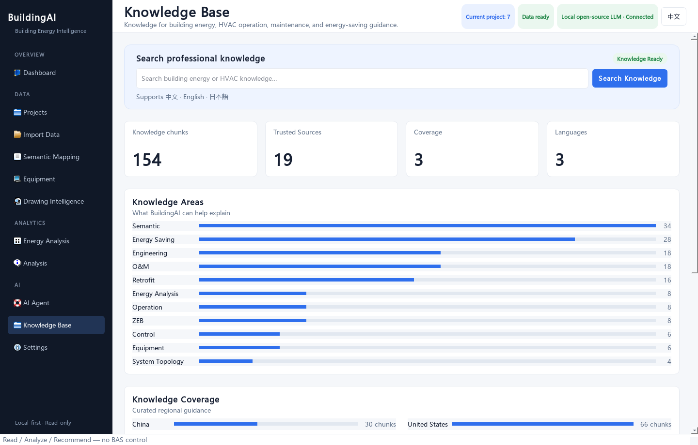
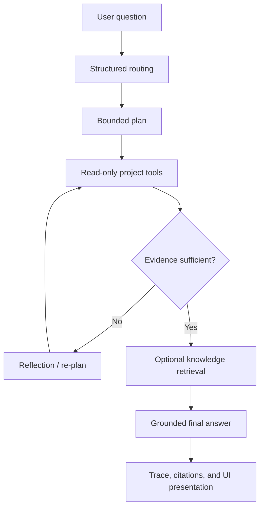

# BuildingAI

> **Agentic AI Building Energy Intelligence Platform**

Turn heterogeneous BEMS data into understandable energy insights, equipment diagnostics, and actionable recommendations through Agentic AI.

面向异构建筑运行数据的智能能源分析与 Agent 应用平台。

[](https://www.python.org/)


**English | [简体中文](README_zh.md)** · [Architecture](docs/architecture.md) · [Knowledge sources](docs/knowledge_sources.md)

## What it does

- Understands unfamiliar BEMS / HVAC point names in Chinese, English, and Japanese.
- Discovers equipment and operating signals, then analyzes energy, power, COP, ΔT, and equipment performance.
- Turns deterministic findings into clear diagnostics and practical energy-saving next steps.
- Answers questions with an AI Assistant that uses the selected project's evidence and, when needed, cited engineering knowledge.



*A local Project 7 dashboard: measured energy, demand, COP, equipment status, and reviewed operating findings.*

## Why it matters

Building energy analysis often starts with a difficult manual task: interpreting hundreds of inconsistent BEMS point names before engineers can tell which equipment matters or what the data means. BuildingAI reduces that setup work by organizing heterogeneous operational data into equipment-aware analysis, then presenting the result as evidence-backed insights that engineers and non-specialists can act on.

It is not a generic chatbot and it has no BAS write path. The project reads, analyzes, explains, and recommends; site teams remain responsible for validation and operational decisions.

## From raw data to action


```mermaid
flowchart LR
    A[BEMS CSV / Excel] --> B[Semantic understanding]
    B --> C[Equipment discovery]
    C --> D[Energy & KPI analytics]
    D --> E[Diagnostics]
    E --> F[Actionable recommendations]
    F --> G[AI Assistant]
```

## Product experience

### Energy analysis

Visualizes available energy consumption, demand, temperature trends, COP, ΔT, and equipment-level performance rather than forcing users to read raw exports.



### AI Assistant with source-aware answers

The Assistant shows a concise analysis process, separates **Project evidence** from **Reference material**, and makes each cited official source available through the UI. Internal tool identifiers stay inside the technical trace rather than in normal user-facing language.



### Professional knowledge, visible and searchable

The built-in knowledge page provides a friendly entry point to multilingual HVAC, operations, and energy-saving guidance—without turning the product into a database console.



## Key features

| Capability | What it enables |
| --- | --- |
| **Automatic BEMS understanding** | Maps heterogeneous Chinese, Japanese, and English point names to standardized HVAC semantics, with physical consistency checks and human review boundaries. |
| **Energy & equipment analytics** | Calculates available KPIs and organizes energy, power, temperature, COP, ΔT, and equipment performance. |
| **Evidence-grounded diagnostics** | Combines deterministic engineering logic with bounded Agent reasoning so project conclusions are not created from general knowledge alone. |
| **Actionable recommendations** | Converts findings into understandable operations, maintenance, and energy-saving next steps, with site-validation boundaries. |
| **AI Assistant** | Supports multi-step analysis, read-only tool use, project-scoped memory, knowledge retrieval, reflection, citations, and trace visibility. |
| **Pluggable LLMs** | Supports Local Qwen through Ollama plus OpenAI-compatible providers, while core analysis works without an LLM. |

## Agentic AI in one real workflow

For a question such as **“Which machine is doing the worst?”**, BuildingAI does more than generate text:

1. Identifies an equipment-analysis task.
2. Reads equipment KPIs from the selected project.
3. Checks existing diagnostic findings.
4. Detects whether the available evidence is incomplete.
5. Re-plans for additional diagnostic or time-series evidence when needed.
6. Retrieves engineering guidance only when it can help explain causes or suggest checks.
7. Produces a bounded answer with project facts and knowledge sources presented separately.


```mermaid
flowchart TD
    Q[User question] --> R[Structured routing]
    R --> P[Bounded plan]
    P --> T[Read-only project tools]
    T --> E{Evidence sufficient?}
    E -- No --> X[Reflection / re-plan]
    X --> T
    E -- Yes --> K[Optional knowledge retrieval]
    K --> A[Grounded final answer]
    A --> O[Trace, citations, and UI presentation]
```

The runtime includes structured routing, bounded planning, tool permissions, evidence checking, reflection / re-plan, conversation and project memory, RAG, and persisted traces. It is deliberately read-only: it does not call building-control protocols or issue operational commands.

## A curated building-energy knowledge base

BuildingAI includes a compact, attributed knowledge catalog for **China, the United States, and Japan**:

- **19 trusted sources** and **154 curated knowledge chunks**
- Original language retained across **中文 / English / 日本語**
- Normalized concepts connect terms such as `chilled water pump` / `冷冻水泵` / `冷水ポンプ`
- Covers semantic mapping, equipment/system relationships, engineering principles, O&M, controls, energy saving, retrofit, and ZEB guidance

Representative sources include Project Haystack, Brick Schema, public Brick / ASHRAE 223 connection guidance, DOE FEMP, NREL / EnergyPlus, DOE Better Buildings, and public guidance from China and Japan. The catalog contains compact attributed summaries and structured ontology facts; it does not copy paywalled standards, vendor manuals, or user documents.

**Important boundary:** project data determines what happened in a particular building. RAG knowledge is used only to explain concepts, suggest cause candidates, and recommend safe next checks—it never creates a project finding by itself.

See the complete [source registry, usage notes, and rebuild policy](docs/knowledge_sources.md).

## Evaluation: stability plus real-model behavior

BuildingAI uses a two-layer **internal evaluation suite**, not a public benchmark.

| Layer | Purpose | Current documented run |
| --- | --- | --- |
| **Deterministic Agent Regression Suite** | Fast engineering regression for routing, tool selection, grounding, abstention, permissions, memory isolation, RAG retrieval, and prompt-injection boundaries. It intentionally has no LLM latency. | 66 cases; 100% routing/tool selection/task success on the internal suite. |
| **Local-Qwen End-to-End Evaluation** | Executes the complete bounded Agent path with Local Qwen, including tools, evidence checks, reflection, RAG where relevant, and final-answer generation. | 52 cases; `qwen2.5:7b`; 44 real LLM calls; average LLM latency 2.94 s. |

The end-to-end suite contains natural-language paraphrases, multi-turn memory, ambiguous requests, missing-data and unknown-equipment abstention, prompt injection, RAG, and tool-degradation cases. During a documented four-round refinement run, routing improved from **58.8% in Round 1** to **100% in Round 4** on that internal run through failure-case analysis. A later fixed 52-case report measured **98.1% task success** and **98.1% tool-selection accuracy**; results are reported as internal measurements, not claims of generalization.

```powershell
# Fast deterministic regression
python scripts/run_agentic_evaluation.py

# Local-Qwen end-to-end smoke / full run
python scripts/run_e2e_agent_eval.py --quick
python scripts/run_e2e_agent_eval.py --full
```

Evaluation artifacts record provider/model identity, real LLM latency, tool calls, reflections, citations, deterministic failure categories, and safe answer summaries. Token usage is shown as `N/A` when a local provider does not expose it.

## Architecture


```mermaid
flowchart TB
    subgraph Presentation
        UI[PyQt desktop]
        API[FastAPI]
    end
    subgraph Application
        TASK[Task service / worker]
        AGENT[Bounded Agent runtime]
    end
    subgraph Core
        SEM[Semantic understanding]
        EQUIP[Equipment discovery]
        ANALYTICS[Energy analytics & diagnostics]
    end
    subgraph AI
        LLM[Local Qwen / OpenAI-compatible]
        MEM[Scoped memory]
        RAG[Curated RAG]
        TRACE[Observability & evaluation]
    end
    subgraph Infrastructure
        DB[(SQLite)]
        DATA[(Parquet / CSV)]
    end
    UI --> TASK
    API --> TASK
    TASK --> AGENT
    TASK --> SEM --> EQUIP --> ANALYTICS
    AGENT --> LLM
    AGENT --> MEM
    AGENT --> RAG
    AGENT --> TRACE
    SEM --> DB
    ANALYTICS --> DATA
    AGENT --> DB
```

The desktop UI only presents state and starts workflows. Services orchestrate reusable domain functions; core modules do not import PyQt. See the concise [architecture notes](docs/architecture.md) for data, persistence, LLM, and safety boundaries.

## Engineering highlights

- Deterministic engineering logic combined with constrained LLM reasoning
- Human-review boundary for semantic mapping and operational validation
- Asynchronous task processing with an optional FastAPI service layer
- Persistent project context, conversation-scoped memory, and source-aware RAG
- Agent, tool, LLM, and evidence traces for technical inspection
- Automated deterministic regression and Local-Qwen end-to-end evaluation
- Prompt-injection detection and read-only tool-permission boundaries

## Quick start

BuildingAI supports Python 3.10+.

```powershell
git clone https://github.com/KaedeharaT/hvac-ai-analyzer.git
cd hvac-ai-analyzer
python -m venv .venv
.\.venv\Scripts\Activate.ps1
python -m pip install -r requirements.txt
python app.py
```

The desktop application works without an LLM. To enable Local Qwen, install [Ollama](https://ollama.com/), pull a model, then select/test it in **Settings**:

```powershell
ollama pull qwen2.5:7b
```

### API

```powershell
python -m pip install -r requirements-server.txt
python -m uvicorn building_ai.api.app:app --host 127.0.0.1 --port 8000
```

### Build the knowledge base

```powershell
python scripts/build_knowledge_base.py
```

The command regenerates curated records, multilingual aliases, portable chunks, the keyword/CJK index, and the configured local SQLite retrieval store. It does not download or commit private building data.

### Tests

```powershell
python -m pytest
```

## Project structure

```text
building_ai/   Desktop UI, services, core analytics, Agent runtime, storage, and API
knowledge/     Curated source registry, multilingual records, chunks, aliases, and index
tests/         Unit, integration, UI, security, and evaluation-support tests
scripts/       Knowledge build, evaluation, acceptance, and screenshot helpers
docs/          Architecture, source policy, and repository documentation
```

## Research background and scope

BuildingAI originates from research on automatically interpreting heterogeneous HVAC/BEMS operational data. This repository turns that research direction into a working AI application with a desktop workflow, API boundary, observability, curated knowledge, and evaluation.

It is an engineering platform / research prototype, not a replacement for site commissioning or a production BAS controller. COP, diagnostics, and recommendations must be validated against the actual building before operational changes are made.

## Further reading

- [Chinese README](README_zh.md)
- [Architecture and boundaries](docs/architecture.md)
- [Knowledge source registry and licensing](docs/knowledge_sources.md)
- [Research-to-product mapping](docs/research_to_product.md)
- [Migration notes](docs/migration.md)
