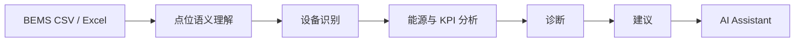
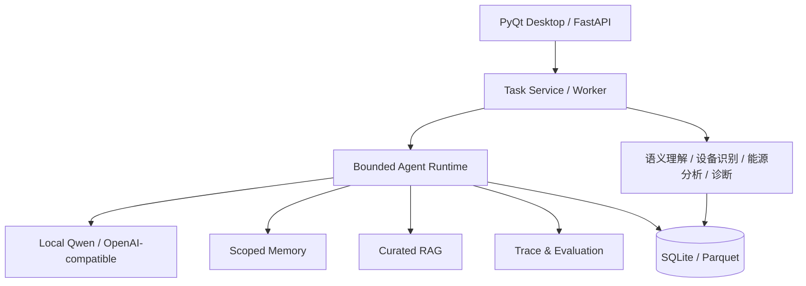

# BuildingAI

> **面向建筑能源的 Agentic AI 智能分析平台**

将异构 BEMS 数据转化为易理解的能源洞察、设备诊断与可执行建议。

**[English README](README.md)** · [架构说明](docs/architecture.md) · [知识来源](docs/knowledge_sources.md)

## 这是什么

BuildingAI 是一个本地优先的建筑能源智能分析平台。它读取 CSV / Excel 格式的 BEMS 与 HVAC 运行数据，理解陌生点位名，识别设备与运行信号，分析能耗、功率、COP 和供回水温差，并将结果呈现为可核查的诊断和建议。

它不是普通聊天机器人，也不会向 BAS 写入控制命令。系统只读取、分析、解释和建议；现场人员仍负责验证与运行决策。

## 它解决什么问题

真实建筑数据往往来自不同系统，点位名称不统一、语言混杂，工程师需要先花大量时间理解数据，才能开始分析。BuildingAI 将这一步工程化：先完成点位语义理解和设备组织，再基于真实项目数据分析问题，并在需要时使用带来源的专业知识解释原因和建议检查方向。


*Project 7 的本地总览：已测能耗、需量、COP、设备状态和已审查的运行发现。*

## 主要能力

| 能力 | 面向用户的价值 |
| --- | --- |
| **自动理解 BEMS 数据** | 支持中文、英文、日文点位名，映射到标准 HVAC 语义，并保留物理一致性与人工复核边界。 |
| **能源与设备分析** | 在数据可用时计算能耗、功率、温度、COP、ΔT 与设备性能。 |
| **证据驱动的诊断** | 用确定性工程逻辑建立项目事实，用受约束的 Agent 推理组织分析，避免以通用知识替代现场证据。 |
| **可执行建议** | 将工程发现转化为工程师和非专业用户都能理解的运维、节能和下一步检查建议。 |
| **AI 助手** | 支持多步骤分析、只读工具调用、项目记忆、知识检索、反思补查、引用与 Trace。 |
| **可插拔 LLM** | 支持 Ollama Local Qwen 和 OpenAI-compatible Provider；不配置 LLM 时核心分析仍可使用。 |

## 从原始数据到行动建议



## 产品界面

### 能源分析

展示可用的能耗、需量、温度趋势、COP、ΔT 与设备级表现，而不是要求用户直接阅读原始导出表。


### 带来源的 AI Assistant

AI Assistant 会展示简洁的分析过程，并明确区分：

- **项目证据**：来自当前 BuildingAI 项目的 BEMS、KPI 与诊断数据。
- **参考资料**：来自检索到的工程、运维或节能知识。

普通用户不会看到内部工具名；工具、检索分数和 Trace 等技术信息仅在按需展开的技术详情中显示。


### 可见、可搜索的知识库

知识库页面不是 Chunk 管理器，而是面向用户的专业知识入口：可搜索 HVAC、运行维护和节能问题，查看地区覆盖、知识领域和可信来源。


## Agent 如何工作

例如用户问：**“哪台设备表现最差？”**，系统会：

1. 识别这是设备分析任务；
2. 查询所选项目中的设备 KPI；
3. 检查现有诊断结果；
4. 判断证据是否足以解释问题；
5. 必要时补查诊断或时序证据；
6. 仅在有帮助时检索专业知识；
7. 输出有边界的结论，并将项目事实与知识来源分开呈现。

运行时包括结构化路由、受限计划、只读工具权限、证据检查、反思 / 重规划、会话与项目记忆、RAG 以及持久化 Trace。系统没有 BACnet、Modbus 或 OPC 写路径。

## 真实知识库

BuildingAI 内置一个紧凑、可追溯的建筑能源知识目录：

- **19 个可信来源、154 个精选知识片段**
- 覆盖 **中国、美国、日本**，保留 **中文 / English / 日本語** 原语言
- 用统一概念连接 `冷冻水泵`、`chilled water pump` 和 `冷水ポンプ`
- 覆盖语义、设备/系统关系、工程原理、运行维护、控制、节能、改造与 ZEB

来源包括 Project Haystack、Brick Schema、公开 Brick / ASHRAE 223 连接资料、DOE FEMP、NREL / EnergyPlus、DOE Better Buildings，以及中国和日本政府公开资料。知识库只保存简短、带来源的事实性摘要和结构化本体事实，不复制付费标准、厂商手册或用户文档。

**关键边界：** 项目数据决定当前建筑实际发生了什么；RAG 只负责解释概念、提供原因候选和推荐下一步检查，不能自行生成项目 Finding。

完整来源、许可和重建说明见 [docs/knowledge_sources.md](docs/knowledge_sources.md)。

## 评测与可靠性

BuildingAI 使用两层 **内部评测体系**，不是公开 benchmark：

| 评测层 | 作用 | 已记录的运行 |
| --- | --- | --- |
| **确定性 Agent 回归套件** | 快速检查路由、工具选择、证据、弃答、权限、记忆隔离、RAG 和 Prompt Injection 边界；故意不调用 LLM。 | 66 cases；该内部套件的 routing / tool selection / task success 为 100%。 |
| **Local-Qwen 端到端评测** | 使用真实 Local Qwen，执行完整 Agent 路径：工具、证据检查、反思、需要时的 RAG 与最终答案。 | 52 cases；`qwen2.5:7b`；44 次真实 LLM 调用；平均 LLM 延迟 2.94 秒。 |

通过失败 Case 分析，某次四轮内部优化的路由准确率从第一轮的 **58.8%** 提升至第四轮的 **100%**。后续固定 52-case 运行记录为 **98.1% Task Success** 和 **98.1% Tool Selection Accuracy**。这些是内部测量，不应被解读为泛化或行业 benchmark 声明。

```powershell
python scripts/run_agentic_evaluation.py
python scripts/run_e2e_agent_eval.py --quick
python scripts/run_e2e_agent_eval.py --full
```

## 架构



UI 只负责展示状态和启动工作流；服务层协调复用的领域逻辑；核心模块不依赖 PyQt。详细边界见 [docs/architecture.md](docs/architecture.md)。

## 快速开始

需要 Python 3.10+：

```powershell
git clone https://github.com/KaedeharaT/hvac-ai-analyzer.git
cd hvac-ai-analyzer
python -m venv .venv
.\.venv\Scripts\Activate.ps1
python -m pip install -r requirements.txt
python app.py
```

无需 LLM 也可使用核心分析。若要启用 Local Qwen，先安装 [Ollama](https://ollama.com/)，拉取模型，再到 **Settings** 选择并测试连接：

```powershell
ollama pull qwen2.5:7b
```

### API、知识库与测试

```powershell
# API
python -m pip install -r requirements-server.txt
python -m uvicorn building_ai.api.app:app --host 127.0.0.1 --port 8000

# 重建知识库
python scripts/build_knowledge_base.py

# 测试
python -m pytest
```

知识库重建会生成 curated records、跨语言 aliases、chunks、keyword/CJK index 和配置的本地 SQLite 检索存储；不会下载或提交私有项目数据。

## 项目结构

```text
building_ai/   Desktop UI、服务、核心分析、Agent、存储与 API
knowledge/     来源目录、精选知识、chunks、aliases 与 index
tests/         单元、集成、UI、安全与评测支持测试
scripts/       知识库构建、评测、验收与截图脚本
docs/          架构、来源政策与说明文档
```

## 研究背景与边界

BuildingAI 源于对异构 HVAC/BEMS 运行数据自动语义解释的研究，并将研究方向工程化为桌面工作流、API 边界、可观测性、精选知识和评测体系。

这是一个工程平台 / 研究原型，不是现场调试或生产 BAS 控制器的替代品。COP、诊断和建议在实施前都必须由现场人员结合真实建筑验证。
