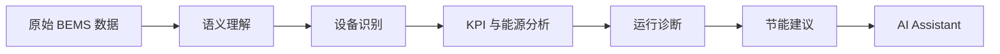
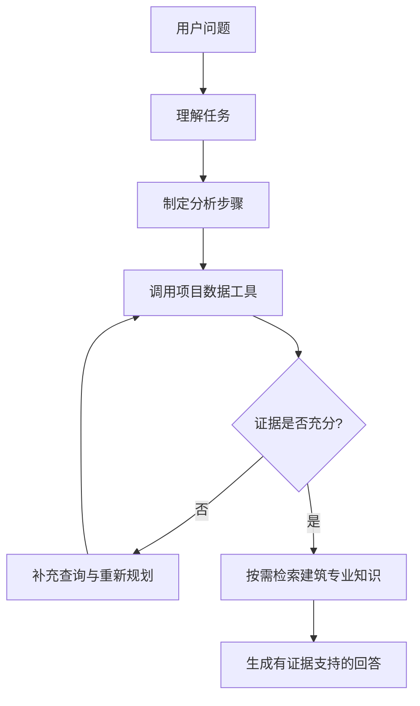
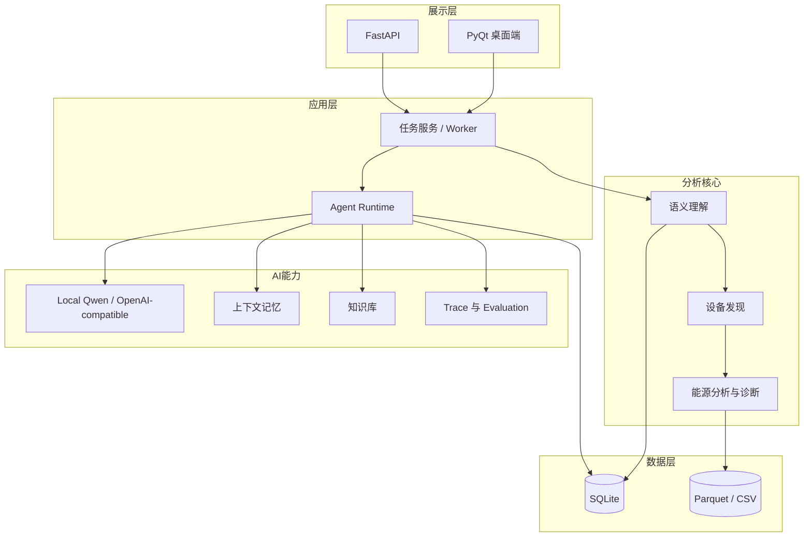

# BuildingAI

### 面向建筑能源分析的 Agentic AI 智能平台

将异构 BEMS / HVAC 运行数据自动转化为：**设备识别、能源分析、运行诊断、节能建议和 AI 问答**。

BuildingAI 面向真实建筑运行数据，结合工程规则、LLM、工具调用与知识检索，实现从陌生 BEMS 数据理解到设备级能源诊断和节能建议生成的完整智能分析流程。

**简体中文 | [English](README.md)** · [架构说明](docs/architecture.md) · [知识来源](docs/knowledge_sources.md)


*Project 7 总览：系统将测量数据、设备状态和运行发现整理为可理解的分析结果。*

## 这个项目解决什么问题

传统建筑能源分析的第一步，往往不是计算，而是人工整理数据。一个项目可能有数百个 BEMS 点位，且常见问题包括：

- 点位命名不统一，同一含义可能有多种写法；
- 中文、英文、日文混杂，难以直接复用分析规则；
- 不清楚温度、功率、流量等点位属于哪台设备；
- 设备关系和物理量关系需要工程师逐一判断；
- 在这些前置工作完成前，能耗、COP、ΔT 和异常分析无法可靠开始。

BuildingAI 的目标，是让系统自动完成一条可审查的分析路径：



它不是单纯的聊天机器人。项目数据决定当前建筑**发生了什么**；AI 的作用是组织分析、补充证据、解释结果，并把工程判断转化为用户可以执行的下一步。

## 核心能力

### 自动理解 BEMS 数据

自动识别不同项目中不统一的点位名称、单位和设备关系，并映射为标准 HVAC 语义。对不可靠或不明确的点位保留人工复核边界，而不是强行猜测。

### 设备与能源分析

基于项目中实际可用的数据计算和展示：

- 能耗、功率和负荷趋势
- 温度、流量与设备运行状态
- COP、ΔT 等设备性能指标
- 设备之间的表现对比


### 运行诊断

结合工程规则与当前项目证据识别异常运行状态，例如冷冻水利用效率偏低、设备运行表现需要关注等。诊断结论始终保留数据范围和现场验证边界。

### 节能建议

将 HVAC 技术诊断转换成普通用户也能理解的检查与改善建议，例如先检查水泵频率、压差控制、旁通阀或末端换热情况，并注明哪些调整需要现场小步验证。

### AI 助手

用户可以直接询问：

> “哪个设备表现最差？”
>
> “AHP-3-3 为什么需要关注？”
>
> “温差偏低应该怎么改善？”

系统会查询当前项目数据、检查现有证据，必要时补充分析，并结合建筑运行知识库生成有依据的回答。


## Agent 如何完成一次分析

对于复杂问题，BuildingAI 使用受边界约束的 Agent 工作流：



对应的工程能力包括：

- 多步任务规划与只读 Tool Calling
- 基于项目数据的 Evidence Checking
- 信息不足时的 Reflection / Re-plan
- 会话与项目上下文记忆
- RAG 知识检索与来源引用
- Agent、工具、LLM 和证据 Trace

这些能力的目的不是堆叠术语，而是让回答能追溯、能解释，并避免将通用知识误当作现场事实。

## 一个真实案例：AHP-3-3 温差偏低

用户问题：

> “AHP-3-3 温差偏低应该怎么改善？”

系统先读取当前项目的 KPI 和诊断结果。Project 7 中，AHP-3-3 的已记录项目证据为：

| 项目证据 | 结果 |
| --- | --- |
| 平均 COP | 3.94 |
| 平均 ΔT | 5.75°C |
| 低 ΔT 样本 | 156 / 773 个有效样本 |

Agent 在发现仅有 KPI 不足以解释原因时，会补充运行与诊断证据，并查询建筑运行知识库。最终建议优先检查：

1. 冷冻水泵频率；
2. 压差控制；
3. 旁通阀；
4. 末端换热状况。

任何流量调整都应在现场进行小步验证，并持续观察温差、功率和室内舒适度。

**边界很明确：** Project Data 决定“发生了什么”；Knowledge Base 用于解释“为什么、检查什么、如何改善”。知识库不会自行生成某台设备的项目 Finding。

## 可见、可搜索的建筑知识库

BuildingAI 内置一个小而可追溯的知识库，而不是不加筛选地堆积 PDF：

- **19 个可信知识来源**
- **154 个精选知识片段**
- 覆盖 **中国、美国、日本**
- 保留 **中文 / English / 日本語** 原语言，并通过统一概念关联同义术语

内容涉及建筑能源、HVAC、设备与系统关系、运行维护、节能控制、既有建筑改造、ZEB 和语义模型。

来源包括 DOE / NREL、EnergyPlus、DOE FEMP、Project Haystack、Brick Schema、Open223 公开资料，以及中国和日本政府公开建筑节能资料。项目不宣称“海量知识”；所有内容均以可追溯、可使用和版权边界清晰为优先。


## 评测：工程回归 + 真实模型行为

BuildingAI 使用两层内部评测体系，目的分别是保证工程稳定性和观察真实 LLM Agent 行为；它们不是公开 benchmark。

### Agent 回归测试

**66 个测试场景**，用于持续验证：

- 问题路由与工具调用
- 项目隔离与上下文记忆
- 证据校验、拒答与防止编造
- RAG 检索与引用
- 提示注入和只读权限边界

这套回归测试为确定性工程测试，不需要真实 LLM，因此 LLM 延迟为零是预期行为。

### Local Qwen 端到端评测

**52 个真实 Agent 场景**，模型为 **Qwen2.5-7B**。实际执行链路为：

```text
用户问题 → Qwen → Agent → Tool Calling → RAG（需要时）→ 最终回答
```

该运行记录了 44 次真实 Local Qwen 调用，平均 LLM 延迟约 2.94 秒。评测覆盖自然语言改写、多轮记忆、模糊问题、数据不足、未知设备、RAG、提示注入和工具降级。详细指标应被理解为 BuildingAI 自建内部测试的结果，而不是对所有建筑项目的泛化承诺。

```powershell
# 确定性 Agent 回归测试
python scripts/run_agentic_evaluation.py

# Local Qwen 端到端评测
python scripts/run_e2e_agent_eval.py --quick
python scripts/run_e2e_agent_eval.py --full
```

## 系统架构



桌面端负责展示和交互；服务层负责流程编排；分析核心不依赖 PyQt。系统支持 FastAPI、后台任务、持久化项目上下文和 Trace，且没有 BACnet、Modbus 或 OPC 写路径。

## 技术栈

Python · PyQt5 · FastAPI · Pydantic · SQLite · Qwen2.5 · Ollama · RAG · pytest

## 快速开始

需要 Python 3.10+：

```powershell
git clone https://github.com/KaedeharaT/hvac-ai-analyzer.git
cd hvac-ai-analyzer
python -m venv .venv
.\.venv\Scripts\Activate.ps1
python -m pip install -r requirements.txt
python app.py
```

核心数据分析不依赖 LLM。若要启用本地 Qwen，请先安装 [Ollama](https://ollama.com/)，拉取模型后在应用的 **Settings** 中选择并测试连接：

```powershell
ollama pull qwen2.5:7b
```

```powershell
# 运行测试
python -m pytest

# 重建知识库
python scripts/build_knowledge_base.py

# 可选：启动 API
python -m pip install -r requirements-server.txt
python -m uvicorn building_ai.api.app:app --host 127.0.0.1 --port 8000
```

## 项目背景与边界

BuildingAI 源于对异构 HVAC / BEMS 运行数据自动语义解释的研究，并将研究方法落实为可运行的桌面应用、Agent 工作流、知识库、评测和可观测性能力。

这是一个工程平台 / 研究原型，不替代现场调试或生产 BAS 控制器。COP、诊断与节能建议在落地前均应结合真实建筑进行现场验证。
