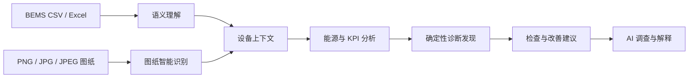
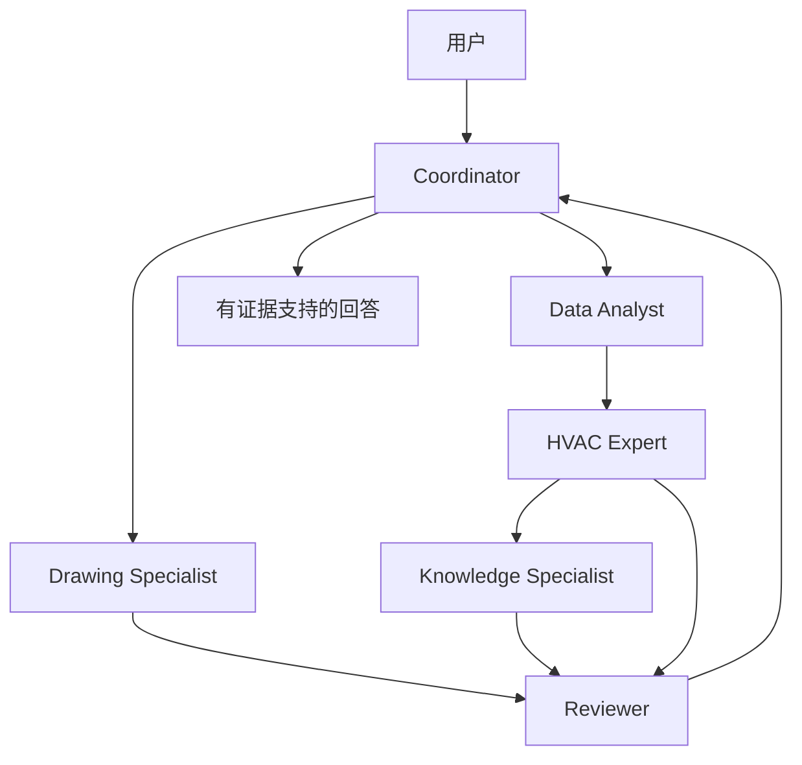
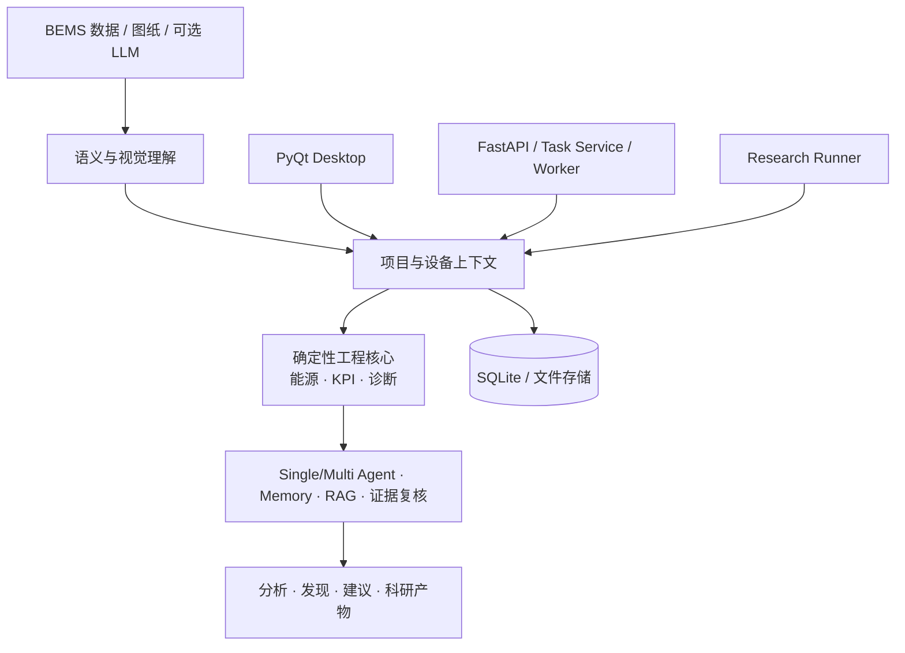

# BuildingAI

### 面向建筑能源智能的 Agentic AI 平台

将异构 BEMS 运行数据与建筑图纸统一转化为设备级能源分析、运行诊断和可追溯节能建议。

[](https://github.com/KaedeharaT/hvac-ai-analyzer/actions/workflows/ci.yml)

**简体中文 | [English](README.md)**


*当前 PyQt 界面；内容来自不含隐私信息的合成演示项目。*

## BuildingAI 解决什么问题

不同建筑项目的 BEMS 通常没有统一数据模式：点位命名因项目而异，中英日标签可能混杂，设备关系隐藏在名称中，而且每份数据能够支持的工程计算并不相同。工程师往往需要先花大量时间整理数据，之后才能分析设备运行表现。

BuildingAI 将这项工作组织成一条可审查的流程：



BuildingAI 不是通用聊天机器人。项目事实来自导入数据、人工复核的语义映射、确定性工程计算和已确认的图纸证据。Agent 只负责选择只读工具、补充证据、检索专业资料并解释结果；它不能控制 BAS，也不能修改项目证据。

## 产品工作流

### 项目总览与数据就绪度

项目总览优先呈现数据就绪度、分析覆盖率、能源概览、当前诊断发现和需要检查的设备。数据导入流程会显示已导入、已映射、待复核、拒绝判断和已确认的点位，让用户能直接理解某项分析为什么可用或不可用。

### 以设备为中心的调查

BuildingAI 以设备为主要分析单元，而不是把图表彼此割裂。设备详情将设备身份、可用信号、KPI 覆盖率、COP、ΔT、功率、能耗、趋势、确定性诊断、已通过检查、图纸关联和上下文 AI 入口组织在一起。


*合成设备与运行数据。*

### 专业能源分析

能源页面使用统一的设备、日期时间范围和聚合粒度控制。当前支持 **1 分钟、10 分钟、1 小时、1 天、1 周、1 月、1 年**。系统不会通过插值、前向填充或复制样本来制造比原始数据更细的分辨率。

计算始终遵守物理量定义：

- 功率按平均值聚合；峰值功率始终取选定范围内的原始最大值；
- 区间能耗按求和聚合，累计能耗表先差分再聚合；
- 温度、ΔT 和 COP 取平均值，COP 同时保留有效样本数；
- 每张图记录周期、分辨率和设备范围，横轴随粒度显示时间、日期、周、月份或年份；
- 典型日曲线和日期 × 时刻热力图只在具有日内含义的粒度下显示。

可用视图包括能耗、功率、温度、ΔT、COP、典型日曲线、热力图、室外温度关系、设备对比和自定义周期对比。页面由数据能力驱动：缺少必需信号时会说明原因，而不是显示空图或伪造数值。


*合成时序数据；坐标轴、单位、范围和聚合均由当前软件生成。*

### 基于证据的运行诊断

诊断发现来自项目数据和确定性工程规则。调查界面严格区分：

1. **诊断发现**：规则实际检测到的现象；
2. **项目证据**：测量值、周期和有效样本；
3. **可能原因**：需要检查的假设，不是已确认故障；
4. **建议检查**：有边界的下一步操作和验证指标；
5. **参考资料**：知识库检索得到的通用工程指导。

“检查通过”仅表示该规则在当前证据下没有触发，不代表设备绝对健康。缺少电价、基线或干预证据时，系统不会编造经济节省。


*合成诊断发现及其支持证据。*

### 具备上下文的 AI Assistant

AI Assistant 会继承当前项目、设备、页面和诊断发现上下文，并提供引导式问题，用户不必反复输入设备编号。回答以调查结果的形式展示已检查证据、可能原因、建议操作与来源引用，并始终将 **项目证据** 和 **参考资料** 分开。


*合成项目上下文；画面中的调查由正常只读 Agent Runtime 生成。*

### 图纸智能识别

可选 Ultralytics 适配器用于加载用户本地配置的 YOLOv8 模型，并处理 PNG、JPG、JPEG 图纸。当前旧研究模型的类别仅为 `aircon`、`baseline_mark`、`window`，仓库不分发模型权重。

检测框和置信度在人工复核前都只是 AI 预测。只有人工确认的对象才能手动关联到设备，并作为项目证据供 Agent 只读查询。图纸检测不会推断设备健康状态、系统拓扑，也不会自动完成 BEMS 与图纸设备匹配。


*合成演示图纸和测试检测结果；不包含私人图纸或模型权重。*

### 可搜索知识库

仓库包含来自中国、美国、日本以及 BuildingAI 原创多语言工程整理的 **19 个可追溯来源**和 **154 个精选知识片段**。检索保留中文 / English / 日本語，并返回来源信息与链接。

项目数据回答“这个项目发生了什么”；知识库用于解释“为什么可能发生、应该检查什么、如何改善”。检索内容不能单独创建项目诊断发现。


详见[来源清单、许可边界与确定性重建流程](docs/knowledge_sources.md)。

## Single-Agent 与 Multi-Agent

Single-Agent 继续作为默认产品 Runtime 和科研 Baseline。可选的角色化 Multi-Agent V1 用于复杂调查和受控科研比较，但系统不预设 Multi-Agent 一定更好。



不同角色通过结构化证据包通信，并拥有独立工具白名单：Data Analyst 不能使用 RAG，Knowledge Specialist 不能宣布项目事实，Drawing Specialist 只读取已确认关联，Reviewer 可以批准、要求补证据、指出冲突或要求拒答。所有注册给 Agent 的工具均为只读。技术详情可追踪父子 Agent、工具、LLM、证据、Reflection 和延迟。

详见 [Multi-Agent 架构与权限边界](docs/multi_agent_architecture.md)。

## 科研与复现

产品 UI 和无界面 Research Runner 调用同一套领域服务。科研层增加结果治理，但不会公开私人数据：

- 使用 SHA-256 绑定数据集，并保留不可变数据版本；
- 独立冻结 Ground Truth，以及项目级 Development / Validation / Frozen Test / External Test 划分；
- 保存 Experiment ID、Git 和 dirty-tree 状态、配置、环境、随机种子、Prompt/Policy 版本和知识库哈希；
- 支持 Artifact Manifest、最终状态不可变、完整性验证、Replay 和失败实验保留；
- 使用配置驱动 Baseline / Ablation Matrix，并对重复 LLM 运行汇总统计；
- 导出 Agent Trace、CV 模型与 Split Provenance、CSV/JSON/Parquet 结果，以及 SVG/PDF/PNG 论文图；
- 建立论文 Claim 与 Experiment 的对应关系。

私人数据、标注、Split、模型权重和实验产物均保持 Git 忽略。科研入口见[研究协议](docs/research_protocol.md)、[科研就绪度审计](docs/research_readiness_audit.md)和[论文结果映射](docs/paper_result_mapping.md)。

## 验证

仓库使用确定性测试覆盖产品、工程计算、安全边界、科研 Provenance、Single-Agent 和 Multi-Agent。下列数字来自本次主线候选的重新验证：

| 检查 | 当前 main 结果 |
| --- | --- |
| pytest | **175 passed** |
| Single-Agent 确定性回归 | **66 / 66** |
| Multi-Agent 确定性回归 | **66 / 66** |
| Agentic Acceptance | **26 PASS / 0 FAIL** |

另有 52-case Local-LLM E2E，它属于**已有记录的内部评测**，不是公开 Benchmark，也不由 GitHub CI 自动运行。更换 Provider 或模型后必须重新评测；自动指标不用于声称经过人工核查的幻觉率。

GitHub Actions 在 Python 3.10 和 3.11 上安装 `requirements.txt`，运行完整 pytest，并执行确定性 Single-Agent 回归。

## 架构



语义映射、设备发现、KPI 计算、诊断规则、YOLO 推理、存储和知识检索仍是确定性服务，不会为了架构名称被伪装成 Agent。详见[架构与安全边界](docs/architecture.md)。

## 快速开始

支持 Python 3.10+：

```powershell
git clone https://github.com/KaedeharaT/hvac-ai-analyzer.git
cd hvac-ai-analyzer
python -m venv .venv
.\.venv\Scripts\Activate.ps1
python -m pip install -r requirements.txt
python app.py
```

Desktop 在没有 Ollama、Redis 或 YOLO 模型时也能启动，确定性分析仍可使用；可选能力会明确显示 Provider 或模型未配置。可选 API 与 Redis/RQ 适配器依赖：

```powershell
python -m pip install -r requirements-server.txt
python -m uvicorn building_ai.api.app:app --host 127.0.0.1 --port 8000
```

常用验证命令：

```powershell
python -m pytest
python scripts/run_agentic_evaluation.py
python scripts/run_multi_agent_evaluation.py
python scripts/run_agentic_acceptance.py
python scripts/build_knowledge_base.py
```

## 范围与安全边界

BuildingAI 是工程分析与科研平台，不是生产 BAS 控制器或 CMMS，也不能替代现场调试。系统没有 BACnet、Modbus、OPC 或设备控制写入路径。所有分析与建议在应用到实际建筑前，都必须结合现场条件复核。

代码采用 [MIT License](LICENSE)。第三方参考资料继续遵循各自许可；BuildingAI 只保存可追溯的简短整理，不重新分发付费标准或私人文档。
